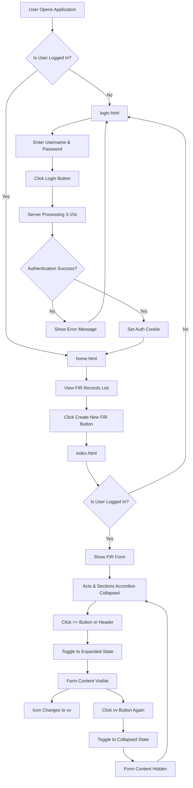

# Fix Navigation Flow and Accordion Toggle

## Current State Analysis

The application has three main pages:

1. **[login.html](login.html)** - Already checks if user is logged in (line 326-328) and redirects to home.html after successful login (line 298)
2. **[home.html](home.html)** - Has authentication check (line 331-333) and "Create New FIR" button that links to index.html (line 307-309)
3. **[index.html](index.html)** - Has the Acts & Sections accordion that needs to toggle properly

## Issues Identified

### 1. Page Load Sequence

- **login.html**: Already correctly redirects logged-in users to home.html ✓
- **home.html**: Already has auth check and redirects to login if not authenticated ✓
- **index.html**: Missing authentication check - needs to redirect to login.html if user is not logged in

### 2. Accordion Toggle Issue

The Acts & Sections accordion in [index.html](index.html) (lines 110-114) has:

- Initial state: `collapsed` class
- Icon: `fa-solid fa-angles-right` (>>)
- Toggle handler exists (lines 2169-2225) but may have conflicts with CSS

The accordion content (line 115) should become visible when clicking the header or icon.

## Implementation Plan

### Step 1: Add Authentication Check to index.html

**File**: [index.html](index.html)

Add authentication check in the initialization script (around line 2155-2160) to redirect unauthenticated users to login.html:

```javascript
// Check authentication - redirect to login if not logged in
if (!AuthService.isLoggedIn()) {
    window.location.href = 'login.html';
}
```

### Step 2: Verify Accordion Toggle Logic

**File**: [index.html](index.html)

The accordion toggle function `setupAccordionToggle()` (lines 2169-2225) already:

- Handles click events on accordion headers
- Toggles between `expanded` and `collapsed` classes
- Changes icon from `fa-angles-right` (>>) to `fa-angles-down` (vv)
- Sets inline styles to force visibility when expanded

This implementation should work correctly. The key inline styles being set are:

- `display: block`
- `visibility: visible`
- `opacity: 1`
- `maxHeight: none`
- `padding: 20px`

### Step 3: Verify CSS Rules

**File**: [style.css](style.css)

The CSS (lines 690-702) has proper rules:

- `.accordion-item.expanded .accordion-content` - shows content with `display: block !important`
- `.accordion-item.collapsed .accordion-content` - hides content with `display: none !important`

The inline styles added by JavaScript (Step 2) will override any CSS conflicts.

### Step 4: Test the Complete Flow

After implementation, the flow will be:



## Files to Modify

1. **[index.html](index.html)** - Add authentication check at initialization (1 line addition)

## Expected Behavior

1. **Initial Load**: User opens any page

   - If not logged in → Redirected to login.html
   - If logged in → Redirected to home.html

2. **After Login**: User successfully logs in

   - Redirected to home.html
   - Can see list of FIR records

3. **Create New FIR**: User clicks "Create New FIR" button

   - Navigated to index.html
   - Auth check passes (user is logged in)
   - FIR form loads with Acts & Sections accordion collapsed

4. **Toggle Accordion**: User clicks >> button or "Acts & Sections" header

   - Accordion expands
   - Form fields become visible
   - Icon changes from >> to vv
   - Clicking again collapses it back

## Testing Checklist

- [ ] Open browser in incognito mode
- [ ] Navigate to any page (should redirect to login.html)
- [ ] Login with any username/password
- [ ] Verify redirect to home.html
- [ ] Click "Create New FIR" button
- [ ] Verify navigation to index.html
- [ ] Verify Acts & Sections accordion is collapsed (>> icon visible)
- [ ] Click the >> button or header
- [ ] Verify accordion expands and form fields are visible
- [ ] Verify icon changes to vv
- [ ] Click again to collapse
- [ ] Verify form hides and icon returns to >>